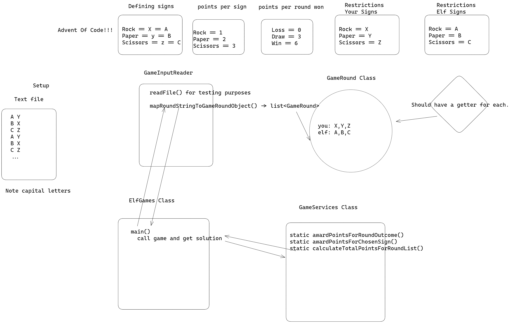

# Advent of Code Day 2
## Summary
This is a repo where I have attempted to solve the [Advent of Code Day 2 Challenge](https://adventofcode.com/2022/day/2).
The repo contains spoilers for a possible solution using Java. The code will not look optimal because the challenge is that
the requirements for the solution will change on part 2.

Original plan in image format

## Running the repo
Download/clone the repo, compile the repo, and then run the Solution.main method.

The other main methods are there to manually test the methods of their corresponding classes.
